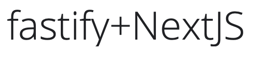

<div align="center">
  
  <h1>fastify-nextjs-project</h1>
  <h4 align="center">🐅 Project template to build a Fastify + NextJS application</h4>
</div>

# Description

This is a template project to build an application using NextJS (Server Side
ReactJS framework) and Fastify (HTTP Server Framework).

NextJS is configured as a _fastify plugin_, source code for NextJS (including
configuration files and type definitions) live inside of the `src/client`
directory.

Server source code (Fastify powered), lives inside of the `src/server` directory.

By default, every route will attempt to render a page ⏤ defined under
`src/client/pages` (read on NextJS for more details) ⏤, unless such route
is under the `api/` route.

Every `api/` prefixed route will reach directly to Fastify's router and will be
handled as defined.

This behavior is configurable on the `src/server/plugin/next.ts` file.

# Usage

## Development

> You will need NodeJS v14.15.4 or greather installed to run this project.

1. Install dependencies

```bash
yarn install
```

This command will download all required dependencies for your project.

2. Run the development server

```bash
yarn run dev
```

Sources will be built and the project will be served on http://localhost:3000/.

## Production

For production use you must build both client and server source into plain
JavaScript.

A configuration for this come OOTB with the `build:production` npm script
will build both client and server sources separately and prepare a directory
with the files

1. Execute `yarn run build:production` to generate `./dist` directory
2. Execute `node ./dist/main.js`

The following output should be printed in your terminal

```log
$ node ./dist/main.js

> event - compiled successfully
```

# Contributing

Every kind of contribution to this project is welcome, please, don't hesitate
to open a Pull Request or Issue. I will be happy to help!
